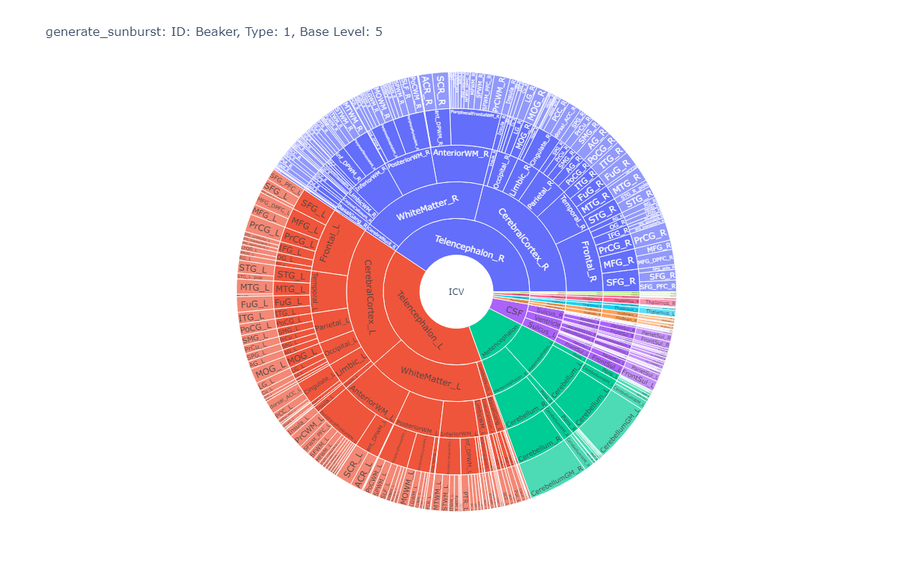
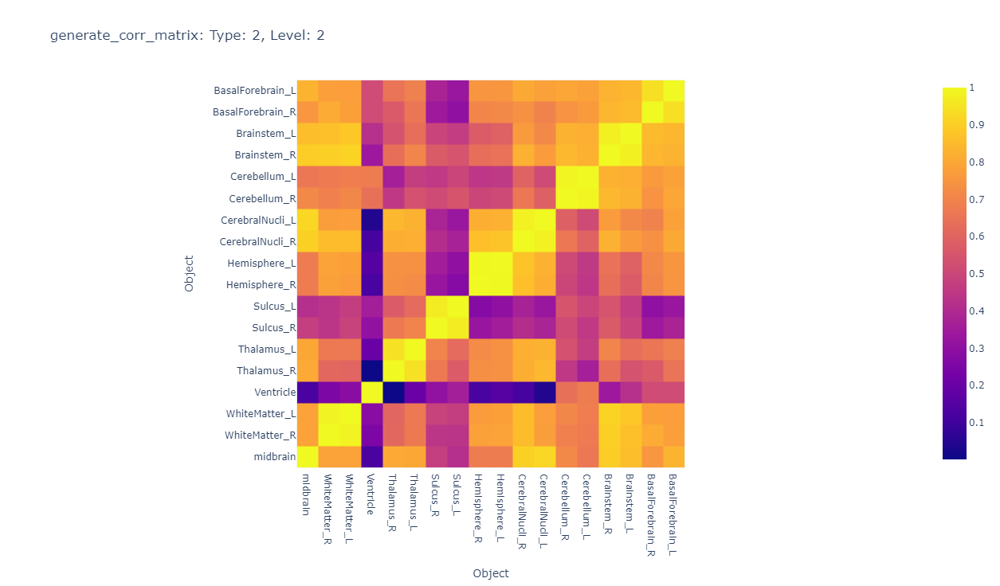

# User Guide

An introductory guide to using MRICloudPy. View the basic example below or navigate to other guides.

---

## Basic example workflow

### Import package

```python
import mricloudpy as mp
```

---

### Creating dataset object from path to MRICloud data files

```python
DATA_PATH = 'mricloudpy/sample_data'
SUBJECTS = ['Kermit', 'Miss Piggy', 'Fozzie', 'Gonzo', 'Rowlf', 'Scooter', 'Animal', 'Pepe', 'Rizzo', 'Beaker', 'Statler', 'Waldorf', 'Swedish Chef']

dataset = mp.Data(DATA_PATH, id_type='custom', id_list=SUBJECTS)
print(dataset.get_data())
```

Uses [`Data`](methods.md), [`get_data`](methods.md/#get_data)

---

### Manipulating data

```python
dataset_wide = dataset.long_to_wide()
print(dataset_wide)
```

Uses [`long_to_wide`](methods.md/#long_to_wide)

---

### Generating visualizations

```python
dataset.generate_sunburst(type=2, id='Beaker', base_level=5)
dataset.generate_mean_diff(type=1, level=4)
dataset.generate_corr_matrix(type=2, level=2)
```

Uses [`generate_sunburst`](methods.md/#generate_sunburst), [`generate_mean_diff`](methods.md/#generate_mean_diff), [`generate_corr_matrix`](methods.md/#generate_corr_matrix)





---

## Covariate analysis

### Appending covariate data

```python
DATA_PATH = 'sample_data_covariate'
SUBJECTS = ['Kermit', 'Miss Piggy', 'Fozzie', 'Gonzo', 'Rowlf', 'Scooter', 'Animal', 'Pepe', 'Rizzo', 'Beaker', 'Statler', 'Waldorf', 'Swedish Chef']
COVARIATE_DATA_PATH = 'sample_data_covariate/covariate_data.csv'

dataset = mp.Data(path=DATA_PATH, id_type='custom', id_list=SUBJECTS)
covariate_dataset = dataset.append_covariate_data(COVARIATE_DATA_PATH, icv=True, tbv=True)
```

Uses [`Data`](methods.md), [`append_covariate_data`](methods.md/#append_covariate_data)

---

### Normalizing covariate data

```python
covariate_dataset = dataset.normalize_covariate_data(covariate_dataset, normalizing_factor='icv')
```

Uses [`normalize_covariate_data`](methods.md/#normalize_covariate_data)

---

### Running OLS regression

```python
print(dataset.OLS(covariate_dataset, covariates=['Age', 'Cerebellum_L_Type1.0_L3.0', 'Hippo_L_Type1.0_L4.0'], outcome='CSF_Type1.0_L1.0', log=False))
```

Uses [`OLS`](methods.md/#OLS)

```sh
                            OLS Regression Results
==============================================================================
Dep. Variable:       CSF_Type1.0_L1.0   R-squared:                       0.500
Model:                            OLS   Adj. R-squared:                  0.363
Method:                 Least Squares   F-statistic:                     3.663
Date:                Wed, 29 Nov 2023   Prob (F-statistic):             0.0474
Time:                        11:35:16   Log-Likelihood:                -161.73
No. Observations:                  15   AIC:                             331.5
Df Residuals:                      11   BIC:                             334.3
Df Model:                           3
Covariance Type:            nonrobust
=============================================================================================
                                coef    std err          t      P>|t|      [0.025      0.975]
---------------------------------------------------------------------------------------------
const                     -8.335e+04   5.36e+04     -1.554      0.148   -2.01e+05    3.47e+04
Age                         999.5951   1160.986      0.861      0.408   -1555.717    3554.907
Cerebellum_L_Type1.0_L3.0     1.1907      0.570      2.088      0.061      -0.064       2.446
Hippo_L_Type1.0_L4.0          9.1820      4.366      2.103      0.059      -0.427      18.791
==============================================================================
Omnibus:                        3.365   Durbin-Watson:                   2.303
Prob(Omnibus):                  0.186   Jarque-Bera (JB):                1.139
Skew:                          -0.276   Prob(JB):                        0.566
Kurtosis:                       4.232   Cond. No.                     1.08e+06
==============================================================================

Notes:
[1] Standard Errors assume that the covariance matrix of the errors is correctly specified.
[2] The condition number is large, 1.08e+06. This might indicate that there are strong multicollinearity or other numerical problems.
```
